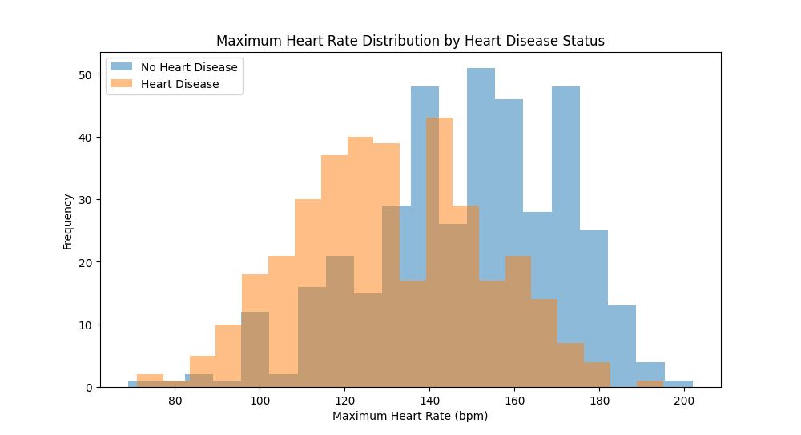

# Heart Disease Data Analyzer

A Python tool that analyzes the Kaggle Heart Failure Prediction Dataset,
calculates statistics, detects clinical anomalies and visualizes key
cardiovascular indicators using Pandas and Matplotlib.

## Features
- Loads and cleans real clinical data from Kaggle
- Calculates statistics for age, blood pressure, cholesterol and heart rate
- Detects clinical anomalies (hypertension, bradycardia, missing values)
- Visualizations comparing patients with and without heart disease

## Dataset
Heart Failure Prediction Dataset — Kaggle: https://www.kaggle.com/datasets/fedesoriano/heart-failure-prediction

## Technologies
- Python
- Pandas
- Matplotlib

## How to run
python heart_disease_analyzer.py

## Results & Interpretation
- **Dataset** 
    - 918 patients were loaded, 172 rows were removed due to missing or invalid values (zero cholesterol, zero blood pressure or unlikely ages), leaving 746 patients for analysis.

    
- **Basic Statistics** 
    - The average patient is 52 years old with a resting blood pressure of 133 mmHg, cholesterol of 244 mg/dL and a maximum heart rate of 140 bpm. These values are consistent with a middle-aged population at cardiovascular risk.
- **Anomaly Detection**
    - 103 patients presented cholesterol above 300 mg/dL, indicating hypercholesterolemia
    - 5 patients presented resting blood pressure above 180 mmHg, indicating severe hypertension
    - No patients presented maximum heart rate below 60 bpm, consistent with the dataset description
- **Maximum Heart Rate** 
    - Patients without heart disease tend to achieve higher maximum heart rates (140–180 bpm), while patients with heart disease are concentrated in lower ranges (100–140 bpm). This is consistent with chronotropic incompetence, a known clinical indicator of cardiac dysfunction where a compromised heart fails to reach normal heart rates during exercise.

    
- **Cholesterol**
    - Both groups show similar cholesterol distributions centered around 200–250 mg/dL, with no clear separation between patients with and without heart disease. This suggests that cholesterol alone is not a strong differentiator in this dataset.

    
- **Age Distribution**
    - Patients without heart disease are more concentrated between ages 40–55, while patients with heart disease are more prevalent from age 55 onwards. This confirms the well-known relationship between aging and increased cardiovascular risk.

    
- **Heart Disease by Sex**
    - The dataset is heavily male-dominated. Among females, the vast majority do not have heart disease (approximately 140 vs 40). Among males, heart disease is slightly more prevalent than its absence (approximately 315 vs 250), suggesting higher cardiovascular risk in men within this population.
    
    

  